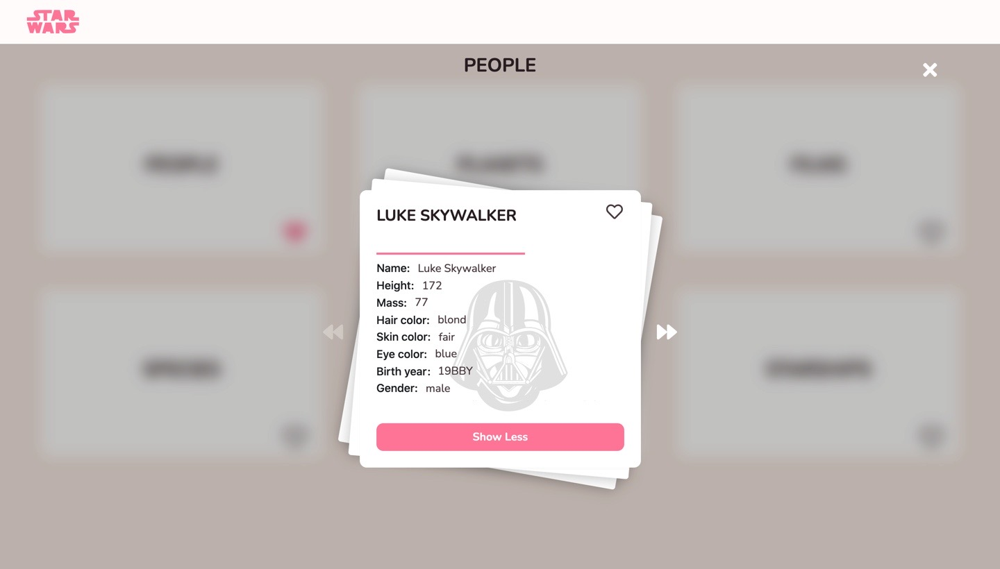

# starwars ⚔️

[https://starwars-force.netlify.app](https://starwars-force.netlify.app/)

Submission for cuvva test, using the Starwars API.

## Installation

bash
yarn install
yarn start

## Screenshots

## Features

- Swipeable cards
- Ability to view root items and their resource
- Navigate between items and linked items.
- Ability to favourite items, favourites are persisted in local storage
- Great accessibility and UX :)

## Technologies used

- Typescript for static analysis.
- React for UI
- Redux for state mgt.
- Styled components for styling.

## Testing

unit-testing for utils done with Jest
bash
yarn test

## Proposed improvements

- even stricter type checking
- react components testing preferably with react testing lib.
